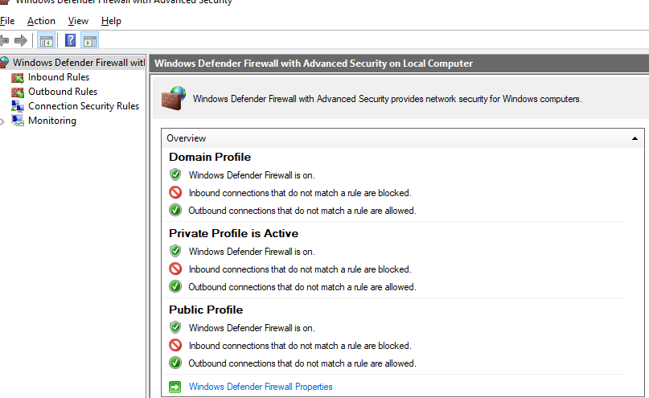

## Windows Firewall

- Configuration can be done via the gui in the MMC console `wf.msc`, via the `netsh advfirewall` commands, or via the `NetSecurity` PowerShell module baked into the Windows Management Framework as of Powershell 3.0
- In Windows XP or Server 2000/2003/R2, the `netsh firewall` commands are the only native way to configure Windows Firewall

### MMC Snap-in - `wf.msc`

- Easiest way to load is to open run with Start+R and open `wf.msc`
- Gives a graphical representation of firewall configuration and rules
- Interface for managing rules, global firewall settings, and ipsec.
- Doesn't have authentication controls here - would be in the group policy

- Default screen gives a status of the firewall status, if it's on, and the block/allow policies for defaults



- Rules are listed in a table format, and are always slow to scroll horizontally.


- Back on the main screen, if you click on "Windows Firewall Properties", you'll be able to edit the default rule behaviors, firewall state, and logging behavior.


### The `netsh advfirewall` commands

- `netsh` commands typically have a `show`, `add`, `set`, and a `dump` command.
- You can `import` and `export` policies to a file from here as well

- Perhaps the most useful command is `reset`, to set it back to the default

```bat
REM Reset the Windows Firewall to defaults
netsh advfirewall reset

REM Enable stateful ftp
netsh advfirewall set global statefulftp enable

REM Set implicit deny
netsh advfirewall set allprofiles firewallpolicy blockinbound,allowoutbound

REM Disable remote firewall management
netsh advfirewall set allprofiles settings remotemanagement disable

REM Enable logging for all connections
netsh advfirewall set allprofiles logging allowedconnections enable
netsh advfirewall set allprofiles logging droppedconnections enable
netsh advfirewall set allprofiles logging maxfilesize 32767
```

#### `mainmode` context

- Allows you to set keysharing default firewall settings
- Used for advanced certificate-based connection auth

```bat
REM Enable Windows Firewall
netsh advfirewall mainmode mode enable

REM Require sha256
netsh advfirewall mainmode add rule="req sha256" mmsecmethods=sha256
```

#### `consec` context

- Set up tunneling and authentication

```bat
REM Show all rules
netsh advfirewall consec show rule all

REM Define security between two hosts/subnets
netsh advfirewall consec add rule name=<string> ^
        endpoint1=any|localsubnet|<address>|<subnet> ^
        endpoint2=any|localsubnet|<address>|<subnet> ^
        action=<require|request>in<require|request|clear>out|noauthentication ^
        [mode=tranport|tunnel] ^
        [type=dynamic|static] ^
        [localtunnelendpoint=<address>|any] ^
        [remotetunnelendpoint=<address>|any] ^
        [port1=#|any] ^
        [port2=#|any] ^
        [protocol=tcp|udp|icmpv<4|6>|any]

REM Example Rule: Create a tunnel between remote hosts
netsh advfirewall consec add rule name="tunnel" mode=tunnel ^
        endpoint1=192.168.0.0/16 endpoint2 192.157.0.0/16 ^
        remotetunnelendpoint=<remote_ip> ^
        localtunnelendpoint=<your_external_ip> ^
        action=requireinrequireout
```

#### `firewall` context

- Allows you to set and manage firewall rules

```bat
REM Show all rules
netsh advfirewall firewall show rule name=all

REM Create Firewall allow or blocking rule
netsh advfirewall firewall add rule name=<string> ^
        dir=in|out ^
        action=allow|block|bypass ^
        [program=<path>] ^
        [service=<service_name>|any] ^
        [profile=public|private|domain|any]
        [localip=[any|<ipv4 address>|<ipv6 address>|subnet] ^
        [remoteip=any|localsubnet|dns|dhcp|<address>] ^
        [localport=#|<range>|RPC|RPC-EMap|IPHTTP|any] ^
        [remoteport=#|<range>|any]
        [protocol=tcp|udp|icmpv<4|6>:type,code|any] ^
        [interfacetype=wireless|lan|ras|any] ^
        [edge=yes|deferapp|deferuser|no] ^
        [security=authenticate|authenc|authdynenc|authnoencap|notrequired]

REM Example Rule: SSHd connections in
netsh advfirewall firewall add rule name=SSHD dir=in ^
        action=allow service=sshd localport=22

REM Example Rule: Firefox out
netsh advfirewall firewall add rule name=firefox_out dir=out ^
        action=allow program="C:\Program Files\Mozilla Firefox\firefox.exe"
```

### `NetSecurity` PowerShell Module

- Included in the Windows management framework alongside PowerShell 3.0
- Is meant to replace netsh firewall commands

```PowerShell
# List commands in module
Get-Command -Module NetSecurity
```

#### Settings commands

- Change settings with the `Set-NetFirewallProfile` command
- Allows you to allow ignored packets as well!
- Note: It doesn't use PowerShell booleans, but GPO Booleans

```PowerShell
# Set firewall behavior
Set-NetFirewallProfile [-All]`
        [-AllowInboundRule <GpoBoolean>] `
        [-Enabled <GpoBoolean>]`
        [-DefaultInboundAction <Action>]`
        [-DefaultOutboundAction <Action>]`
        [-AllowUserPorts <GpoBoolean>]`
        [-LogAllowed <GpoBoolean>]`
        [-LogBlocked <GpoBoolean>]`
        [-LogIgnored <GpoBoolean>]`
        [-LogfileName <string>]`
        [-LogMaxSizeKilobytes <UInt64>]

# Enable implicit deny
Set-NetFirewallProfile -All`
        -Enabled True`
        -DefaultInboundAction Block`
        -DefaultOutboundAction Allow

# Enable Firewall logging
Set-NetFirewallProfile -All -LogAllowed True`
        -LogBlocked True`
        -LogIgnored True`
        -LogfileName 'C:\Logs\packets.log'`
        -LogMaxSizeKilobytes 32767
```

#### Firewall commands

- The commands follow a pattern of "\<task\>-NetFirewall\<item\>"

- Actually supports table view

- Supports many specifics including authentication and encryption.

- View full commands with `Get-Help` or passing the `-?` flag

```PowerShell
# Get all Rules
Get-NetFirewallRule * | ft

# Add new rule
New-NetFirewallRule -DisplayName <String>`
        [-Group <String>]`
        [-Profile <Profile>]`
        [-Direction <Inbound|Outbound>]`
        [-Action <Allow|Block>]`
        [-Protocol <TCP|UDP|ICMPv<4|6>>]`
        [-LocalPort <port|list>]`
        [-RemotePort <port|list>]`
        [-Program <Path>]`
        [-Service <Service name>]`

# Example Rule: Allow SSHd in
New-NetFirewallRule -DisplayName 'SSHd'`
    -Direction Inbound
    -Action Allow
    -Protocol TCP
    -LocalPort 22
    -Service sshd

# Example Rule: Allow Firefox out
New-NetFirewallRule -DisplayName 'firefox_out'`
    -Direction Outbound
    -Action Allow
    -Program 'C:\Program Files\Mozilla Firefox\firefox.exe'
```
